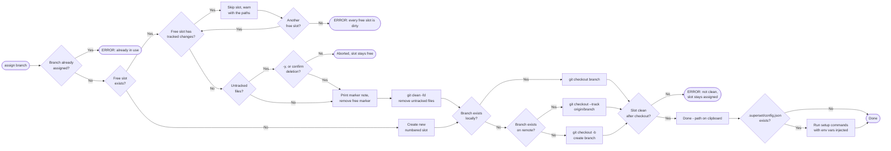
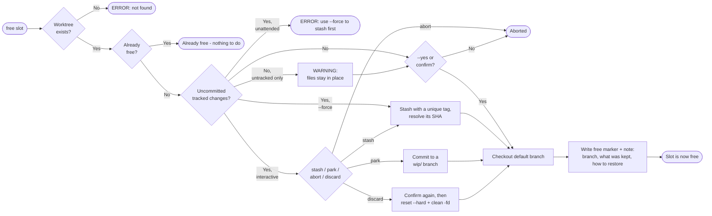
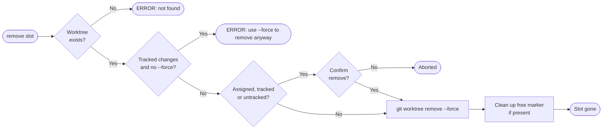

# git-worktree-pool

A reusable [Git worktree](https://git-scm.com/docs/git-worktree) pool manager for repositories where initializing a fresh worktree is expensive (e.g. large dependency installs, IDE re-indexing).

---

## The Problem

Git worktrees let you work on multiple branches simultaneously - each branch gets its own working directory with no stashing required. But creating a fresh worktree can be slow:

```sh
git worktree add ../myrepo-feature feature/my-branch
cd ../myrepo-feature
# ... expensive setup: npm install, build, IDE indexing ...
```

The obvious fix - reusing worktrees instead of recreating them - is exactly what `git-wt-pool` automates.

---

## The Solution: A Worktree Pool

Instead of creating and destroying worktrees per branch, maintain a **numbered pool** of persistent worktrees. Each slot can be either **assigned** (locked to a branch) or **free** (available for reuse). Switching a slot to a new branch is fast because the working directory already exists.

### Directory Layout

```
<parent>/
├── myrepo/                        ← main repo (any branch)
└── myrepo-wt-pool/                ← pool root (sibling of repo)
    ├── .free-myrepo-wt3           ← free marker for slot 3
    ├── myrepo-wt1/                ← assigned to feature/auth
    ├── myrepo-wt2/                ← assigned to fix/login-bug
    └── myrepo-wt3/                ← free (checked out on default branch)
```

### The `.free-<slotname>` Marker

A `.free-<slotname>` file in the **pool root** (not inside the worktree) marks a slot as **free**. Keeping the marker outside the worktree means it never appears in `git status` and no `.gitignore` entry is needed.

| State    | Marker in pool root?        |
|----------|-----------------------------|
| Free     | ✅ `.free-myrepo-wt3` etc.  |
| Assigned | ❌ No marker                |

---

## Installation

```sh
npm install -g git-worktree-pool
```

Or run directly via `npx`:

```sh
npx git-wt-pool list
```

---

## Commands

```
git-wt-pool list | ls                        Show all pool slots and their status (ls is an alias for list)
git-wt-pool assign <branch> [-n] [-y]           Assign a free slot to a branch (copies path to clipboard)
git-wt-pool free   <number|path> [-y] [-f]   Release a slot back to the pool
git-wt-pool remove <number|path> [-y] [-f]   Permanently delete a slot from the pool
git-wt-pool path   [root|<number>]           Copy path of main repo or a pool slot to clipboard
```

### Flags

| Flag | Short | Commands | Description |
|------|-------|----------|-------------|
| `--no-setup` | `-n` | `assign` | Skip post-assign setup hooks |
| `--yes` | `-y` | `assign` | Delete leftover untracked files without asking |
| `--yes` | `-y` | `free`, `remove` | Skip confirmation prompt |
| `--force` | `-f` | `free` | Stash the uncommitted work, then free the slot |
| `--force` | `-f` | `remove` | Remove a slot that holds uncommitted changes |
| `--help` | `-h` | all | Show usage |

### Examples

```sh
# See what's in the pool (works from main repo, any worktree, or pool root)
git-wt-pool list

# Assign a branch - path to the assigned worktree is copied to clipboard automatically
git-wt-pool assign feature/my-feature

# Copy the main repo path or a specific slot path to clipboard, then cd in your shell
git-wt-pool path root
git-wt-pool path 2

# Done with a branch - free the slot for reuse
git-wt-pool free 2

# Permanently remove a slot you no longer need
git-wt-pool remove 3
```

### `list` output

```
  Pool : C:\dev\myrepo-wt-pool
  ---------------------------------------------------
┌─────────┬──────────────┬──────────┬─────────────────┐
│ (index) │ path         │ status   │ branch          │
├─────────┼──────────────┼──────────┼─────────────────┤
│ 1       │ 'myrepo-wt1' │ 'assigned'│ 'feature/auth' │
│ 2       │ 'myrepo-wt2' │ 'assigned'│ 'fix/login-bug'│
│ 3       │ 'myrepo-wt3' │ 'free'   │ '-'             │
└─────────┴──────────────┴──────────┴─────────────────┘
```

---

## Command Flows

### `assign <branch>` - Get a worktree for a branch



### `free <slot>` - Return a worktree to the pool



### `remove <slot>` - Permanently delete a worktree



---

## Post-Assign Setup Hooks (Superset convention)

After a successful `assign`, `git-wt-pool` checks for a `.superset/config.json` file in the repo root. If found, it runs the commands listed in the `setup` array - the same lifecycle hook that [Superset](https://superset.sh) uses when creating a new workspace.

### Config format

```json
{
    "setup": ["node .superset/setup.js"],
    "teardown": [],
    "run": []
}
```

Only `setup` is read. The other keys are ignored.

### Environment variables injected

| Variable | Value |
|---|---|
| `SUPERSET_ROOT_PATH` | Absolute path to the main repo |
| `SUPERSET_WORKSPACE_PATH` | Absolute path to the assigned worktree slot |
| `SUPERSET_WORKSPACE_NAME` | The branch name |

Commands run sequentially with `cwd` set to the assigned worktree slot and `stdio: "inherit"` so all output is visible. If any command exits non-zero, the process exits with an error.

Repos without `.superset/config.json` are unaffected - the hooks step is silently skipped.

---

## Tips

- **How many slots?** Start with 3. Add more with `assign` - the pool grows automatically.
- **Slot numbering** fills gaps: if `wt2` is removed, the next `assign` reuses number `2`.
- **A dirty slot is never handed out.** Cleanliness comes from `git status --porcelain`, so untracked files count. `git diff --quiet HEAD` is not used: it cannot see untracked files, and `git checkout <branch>` carries staged changes across with exit code 0 when the dirty paths are identical in HEAD and in the target branch.
- **Dirty guard on `free`** - a slot with uncommitted tracked changes is never freed unattended. `--force` stashes the work first and discards nothing. Run `free` interactively to choose a stash, a `wip/` branch, abort, or an explicitly confirmed discard. Discard is never reachable under `-y`.
- **The free marker records what was left behind.** `.free-<slot>` is JSON: when the slot was freed, which branch it was on, and how to restore work that was stashed or parked. `assign` prints it when it repurposes the slot. Markers written by older versions are zero-byte and still read as "free, no note".
- **Guard on repurpose** - `assign` skips a free slot that still holds tracked changes and warns with the paths. It asks before `git clean -fd` deletes untracked files (`-y` deletes them without asking). After the checkout it re-checks that the slot is clean, and fails loudly if it is not. Files covered by `.gitignore` (e.g. `node_modules`) are never touched by `git clean -fd`.
- **The stash stack is shared** by the main repo and every slot, so `free` tags each entry uniquely and records its SHA. Restore is always `git stash apply <sha>`, never `stash@{0}` and never `stash pop`.
- **Default branch checkout** - `free` checks out the repo's default branch before releasing, so the freed branch is no longer locked in any worktree and can be deleted immediately with `git branch -d`.
- **Branch creation** - `assign` creates the branch if it doesn't exist, branching from the repo's default branch (main/master).
- **Remote tracking** - if the branch exists on `origin`, it is checked out with tracking automatically.
- **Works alongside your main repo** - the pool lives as a sibling directory and never touches your primary checkout.
- **Post-assign setup** - if a `.superset/config.json` exists, its `setup` commands run automatically after every `assign` (e.g. copy `.env`, allocate a port, run `npm install`). See [Post-Assign Setup Hooks](#post-assign-setup-hooks-superset-convention) above.

---

## Implementation

The CLI is implemented in TypeScript using Node.js built-ins (`node:util`, `node:child_process`, `node:fs`, `node:path`) and [`clipboardy`](https://github.com/sindresorhus/clipboardy) for cross-platform clipboard access. Args are parsed with `parseArgs` from `node:util`.

```
src/
└── bin/
    └── git-wt-pool.ts     ← CLI entry point (all commands)
```
